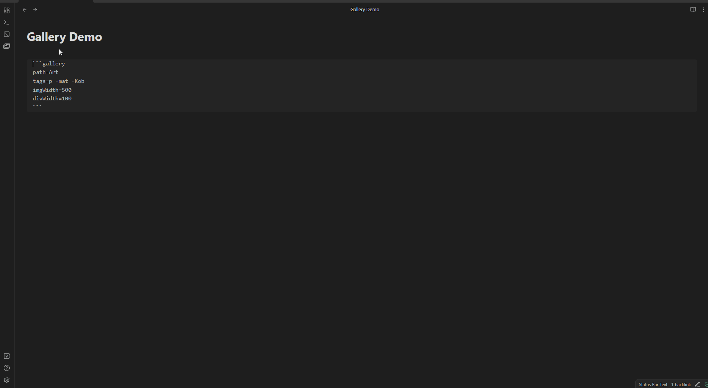
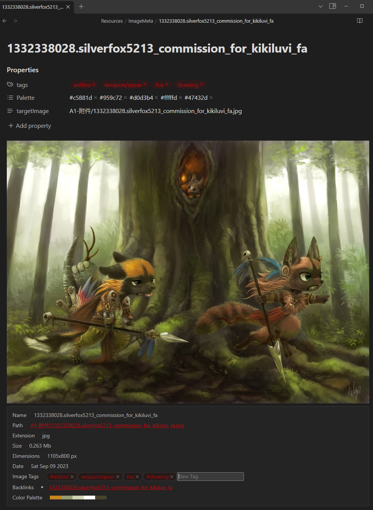
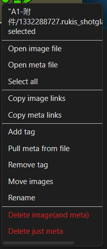

# Tagged Gallery

- Main Gallery to tag / filter / add notes to images.
- Filter by frontmatter criteria and change the meta right in the side panel
- Display blocks to embed images inside notes
- Display block to an image information

## Examples:

### [Main Gallery](https://github.com/TomNCatz/obsidian-gallery/blob/main/docs/README_MainGallery.md)

### [Display blocks](https://github.com/TomNCatz/obsidian-gallery/blob/main/docs/README_DisplayBlocks.md)

### [Meta Files and Templates](https://github.com/TomNCatz/obsidian-gallery/blob/main/docs/README_MetaFiles.md)

### [Context Menu](https://github.com/TomNCatz/obsidian-gallery/blob/main/docs/README_ContextMenu.md)

## [Tenative Roadmap](https://github.com/TomNCatz/obsidian-gallery/blob/main/docs/README_Roadmap.md)

This is a continuation of developement from Darakah's obsidian-gallery, found here https://github.com/Darakah/obsidian-gallery
